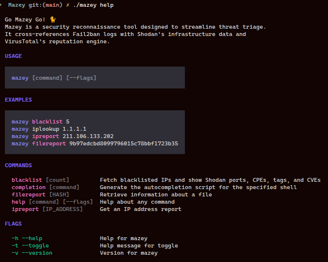
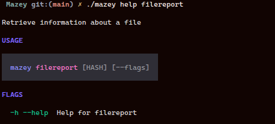

# Mazey

Mazey is an early-stage CLI for threat triage.

It currently pulls blacklisted IPs from a Fail2ban-style API [see here](https://github.com/jim3/fail2ban-blacklist-api) and enriches them with Shodan InternetDB data (ports, hostnames, CPEs, tags, and known vulnerabilities).

## Project status

This repository is the initial foundation of a larger security tooling project.

- Active development (work in progress)
- Core ideas are in place; features and structure will evolve over time
- Public progress is intentional: this repo documents learning, iteration, and long-term improvement

## Why the name?

`mazey` is named in tribute to my cat. This is a personal project with long-term goals.

## Current features

- `blacklist [count]` command
- Reads blacklist source from `API_ENDPOINT`
- Enriches each IP through Shodan InternetDB

## Tech stack

- Go
- Cobra + Fang (CLI framework / UX)
- `godotenv` for local env loading

## Quick start

### 1) Set environment variable

Copy the template and edit values:

```bash
cp .env.example .env
```

Then set values in `.env`:

```env
API_ENDPOINT=https://your-fail2ban-api.example.com/blacklist
VT_API_KEY=replace-with-your-virustotal-api-key
```

### 2) Build or run

```bash
make build
./mazey blacklist 5
```

or

```bash
make run ARGS="blacklist 5"
```

## Make targets

- `make help` - list available targets
- `make build` - build binary
- `make run ARGS="..."` - run CLI with args
- `make test` - run tests
- `make fmt` - format Go code
- `make vet` - run static checks
- `make tidy` - clean module dependencies

## Roadmap (high level)

- Add more intelligence sources and richer reporting
- Improve command coverage and output formatting
- Add tests and stronger error handling
- Evolve into a more complete incident triage assistant

## Coming next (brief TODO)

- Add VirusTotal file report lookup (`/api/v3/files/{id}`)
- Support `VT_API_KEY` for authenticated VT requests
- Improve API error handling for 4XX/5XX responses and clearer CLI output

### Planned commands

- `filereport <hash>` - retrieve a VirusTotal file report
- `ipreport <ip>` - enrich and summarize IP reputation details ✅

## Preview

### Mazey Help & Command Menus

---



---
<br>


