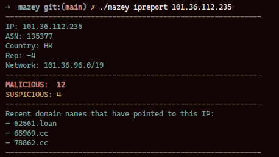

# Mazey

**Mazey** is an early-stage CLI reconnaissance tool for threat triage. It takes *inbound noise* such as automated scans, bots, misconfigured devices and enriches them using various threat intelligence API's like Virus Total, Shodan, etc...

<sub>Mazey can be used with static mock data or integrated into an automated threat-intel pipeline (see below for an example 🛠).</sub>

## Why the name?
`Mazey` is named in tribute to my cat. This is a personal project with long-term goals! 🐈


## Usage

```shell
mazey <COMMAND> <ARGUMENT> [FLAGS]
```


## Commands

- `blacklist [COUNT]` Get a pool of IPs from the blacklist API (default 10)
- `ipreport <IP_ADDRESS>`  Get an IP address report
- `filereport <FILE_HASH>` Get a file hash report
- `help [COMMAND]` Show help for a command


## Tech stack
- Go + Cobra + Fang (CLI framework / UX)


## Set environment variables
```
API_ENDPOINT=http://localhost:8080/blacklist
VT_API_KEY=your-virustotal-api-key
```


## Build or run
```bash
make build
mazey filereport 9b97edcbd8099796015c78bbf1723b35
```


## Make targets
- `make help` - list available targets
- `make build` - build binary
- `make run ARGS="..."` - run CLI with args
- `make fmt` - format Go code
- `make tidy` - clean module dependencies


## Preview Images
### Mazey Help & Command Menus


---
<br>


---

### IP Report
<br>



<br>
<br>

## TODO
- Finish `blacklist`'s functionality, not totally wired up yet
- Actually a "NOT TODO!" do not add more commands. Focus on making the existing ones better.

## 🛠 The Data Pipeline
<details>
<summary>Click to see how Mazey automates threat intelligence gathering</summary>

### Pipeline at a Glance
```text
[VPS cron job @ 03:00]
	parse /var/log/auth.log for failed SSH attempts
					|
					v
	write /tmp/blacklist.json (deduped IPs)
					|
					v
[Local sync script]
	scp -> validate JSON -> atomic replace
	/home/user/ip-blacklist/blacklist.json
					|
					v
[Go HTTP server]
	GET /blacklist -> serves local JSON
					|
					v
[Mazey CLI]
	reads API_ENDPOINT and enriches IPs
```


## Pipeline stages

### 1) The Harvester (Generation)
Purpose: generate a blacklist JSON from failed SSH login attempts.

- Input: `/var/log/auth.log`
- Filters: `Failed password` and `Invalid user`
- Output: `/tmp/blacklist.json`
- Schedule: daily at `03:00`

Reference cron entry:

```bash
0 3 * * * /usr/bin/grep -E "Failed password|Invalid user" /var/log/auth.log | /usr/bin/grep -oE '\b([0-9]{1,3}\.){3}[0-9]{1,3}\b' | /usr/bin/sort -u | /usr/bin/jq -Rsc 'split("\n") | map(select(length > 0)) | {blacklist: .}' > /tmp/blacklist.json
```

JSON structure example:

```json
{"blacklist": ["1.2.3.4", "5.6.7.8"]}
```

### 2) The Courier (Transport)
Purpose: pull the JSON from VPS and safely update a local copy.

- Uses `flock` to prevent overlapping runs
- Uses `scp` to pull remote file
- Uses `jq` to verify `.blacklist` exists and is an array
- Uses atomic replace (`mv`) after validation

```shell
#!/usr/bin/env bash
set -euo pipefail

# ---- config ----
REMOTE=<user>@<vps-ip>:/tmp/blacklist.json
TARGET=<path-to-local>/blacklist.json
TMP="${TARGET}.tmp"
LOCK="${TARGET}.lock"

# ---- prevent overlapping runs ----
exec 9>"$LOCK"
flock -n 9 || exit 0

# ---- fetch -> validate -> atomic replace ----
scp -q "$REMOTE" "$TMP"
jq -e '.blacklist and (.blacklist | type == "array")' "$TMP" >/dev/null
mv "$TMP" "$TARGET"

echo "$(date '+%Y-%m-%d %H:%M:%S') sync ok"

```

### 3) The Librarian (API)
Purpose: serve the local JSON file via a REST API for the Mazey CLI to consume.

A lightweight Go **service** that monitors the local JSON file and exposes it via a REST endpoint. This decouples the CLI from the filesystem and allows for future expansion (like a Web Dashboard).
- **Port:** `:8080`
- **Endpoint:** `/blacklist`
- **Logic:** Decodes the local `blacklist.json` and streams it to the Mazey CLI.

</details>
